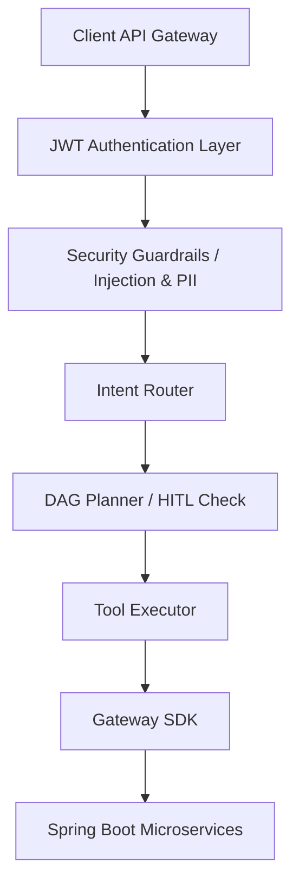

# DigiPay AI Platform Architecture Guide

This guide documents the software design layers, components, and pipelines of the DigiPay AI Platform.

---

## 1. System Topology & Layers

The platform uses a modular, decoupled middleware layer structure:

### Core Architecture Components

* **API Gateway & Auth**: Secures the platform and authenticates calls.
* **Security & Guardrails**: Inspects inputs, filters prompt injections, masks PII data, and sanitizes outputs.
* **Intent Router**: Classifies incoming merchant issues.
* **DAG Planner**: Creates execution DAGs for multi-step tasks.
* **Tool Executor**: Checks permissions and runs tools.
* **Gateway SDK**: Resilient wrapper for Spring APIs.
* **RAG & Memory**: Hybrid search for context retrieval.
